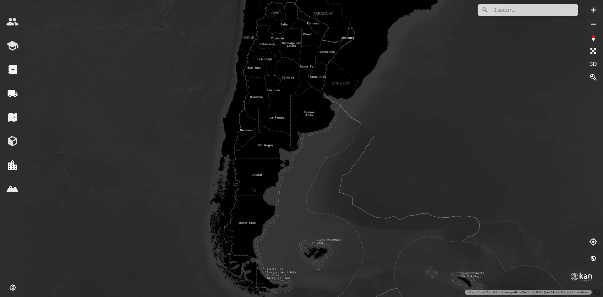
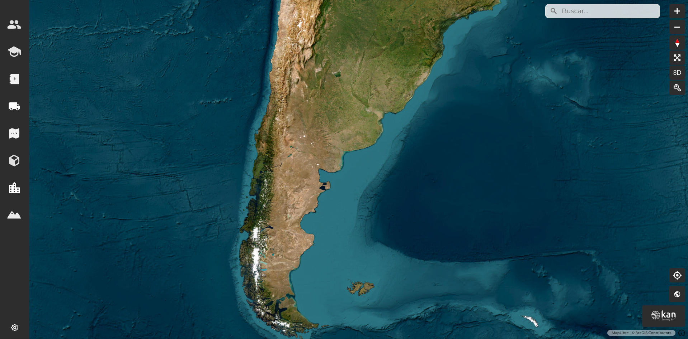

# Selector de mapa base

En la esquina inferior derecha de la pantalla, se encuentra un cuadrado con un mapa en su interior, con el cual es posible elegir el mapa base del visor, sobre el que se muestran todas las capas. Al pasar el cursor sobre este cuadrado, se despliegan junto a él otros 4 cuadrados con un mapa base diferente cada uno.

El mapa base que se encuentra por defecto en el visor es Argenmap, el mapa base del Instituto Geográfico Nacional (IGN).

Luego, está el mapa de OpenStreetMap.

Otro mapa base disponible es el Argenmap gris.

También se puede seleccionar el Argenmap oscuro como mapa base.

Por último, se halla disponible el mapa de imágenes satelitales Esri.

