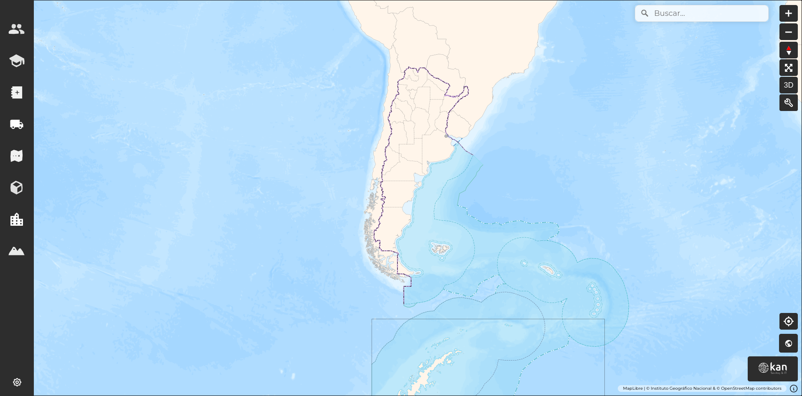

# GeoExpress Visor

## Introduction

This document describes the various functionalities and capabilities of the GeoExpress viewer [https://geoexpress.kan.com.ar](https://geoexpress.kan.com.ar), version 2.2.0. 
The objective is for the end user to navigate comfortably and make the most of all the tools available. To achieve this, we will provide a detailed overview of all sections and buttons in the viewer, emphasizing the user's perspective within the interface.

