# Tarjeta de capa

La tarjeta de capa permite al usuario diversas operaciones relacionadas con la capa.

## Opacidad

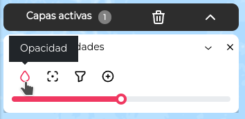
/// caption
Opacidad
///

En Geoexpress, la opacidad de todas las capas es del 50% por defecto, a menos que se haya determinado una opacidad específica previamente. Algunas capas, como los mesh, DEMs y objetos 3D, tienen opacidad fija y no se puede modificar.

## Zoom a capa

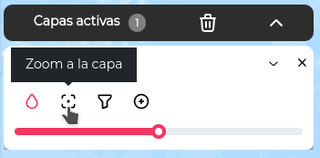
/// caption
Zoom
///

El ícono de **Zoom a la capa** ajusta la vista del mapa a la extensión de la capa que se encuentra actualmente activa.

## Filtros

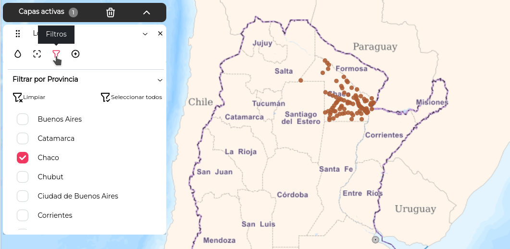
/// caption
Filtros
///

El botón **Filtros** permite hacer un filtrado de los datos de la capa. Como ejemplo, la capa Localidades esta organizada por provincias y por medio del filtro, podremos seleccionar algunas, todas o ninguna

!!! warning

    RESTRICCIÓN: Si se supera el límite de 30 opciones para seleccionar, el filtro de selección no aparecerá en la tarjeta de capas.

## Más operaciones

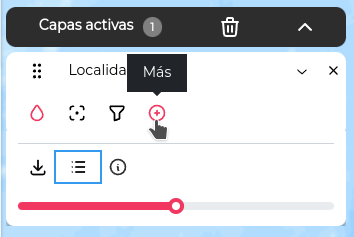
/// caption
Mas operaciones
///

El botón **+** nos muestra mas opciones para trabajar con las capas. Nos permite

* Descargar la capa en formato .zip

  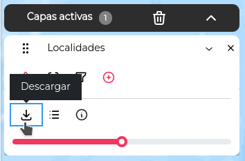
  /// caption
  Descargar
  ///

* Activar las referencias de los elementos de la capa

  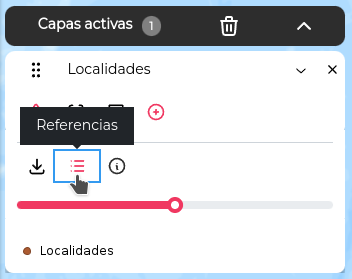
  /// caption
  Referencias
  ///

* Ver informacion de la capa

  Apretando en

  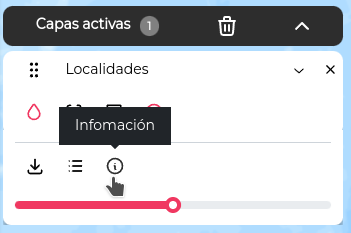
  /// caption
  Información
  ///

  Nos muestra

  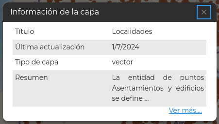
  /// caption
  Información
  ///

## Icono BIM

El ícono de BIM está disponible solo para capas de objetos 3D con archivos .ifc cargados.

/// caption
BIM
///

Al hacer clic sobre el ícono, permite analizar el objeto 3D y activar o desactivar sus elementos. Para volver al mapa, se hace clic en la flecha en la esquina superior izquierda.

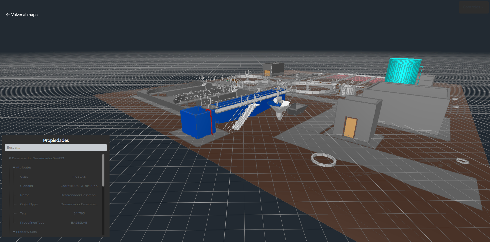
/// caption
Objeto 3D
///

## Administracion de capas

### Superposición de capas

Si se activan múltiples capas, el orden se determina por el orden de activación, con la última capa sobreponiéndose a las demás

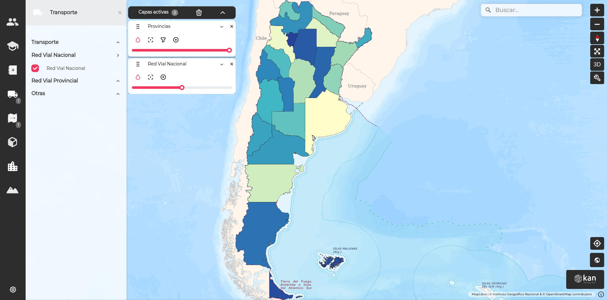

Este orden puede modificarse arrastrando las tarjetas de capa en el listado. Esto generará que también se cambie el orden de superposición de las capas en el mapa.

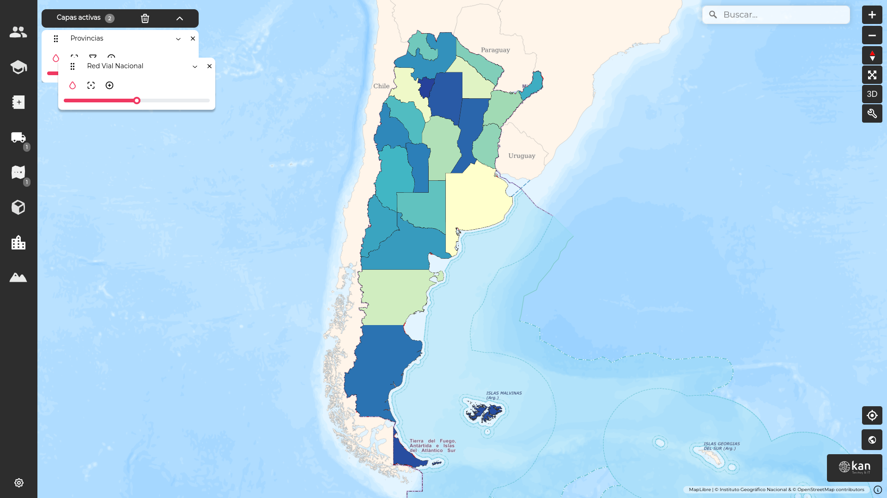

quedando..

### Deshabilitar capas

Para desactivar una capa, se puede destildar en el panel de capas o cerrar la tarjeta de capa.

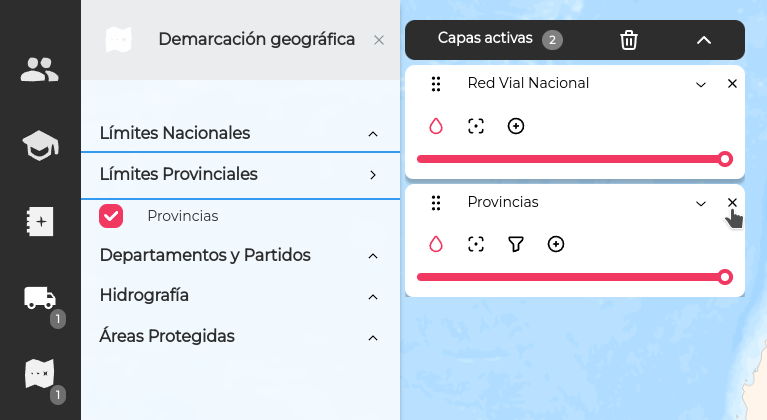

La barra negra con la leyenda "Capas activas" permite desactivar todas las capas activas con el botón de cesto de basura.

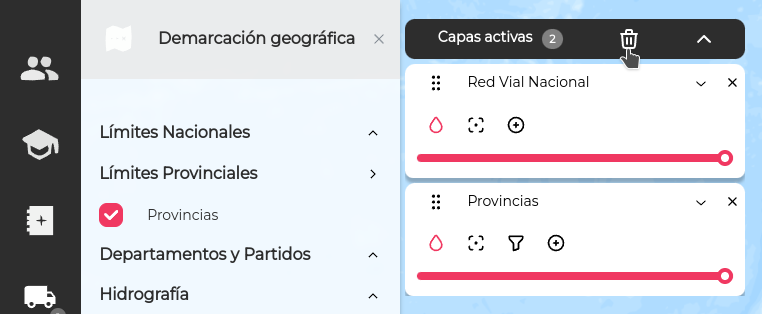

La barra de capas activas también posee una flecha para arriba que, al hacer clic sobre ella, oculta las tarjetas de capa. Una vez ocultas, puede hacerse clic en la misma flecha, ahora orientada hacia abajo, para mostrar de nuevo las tarjetas.

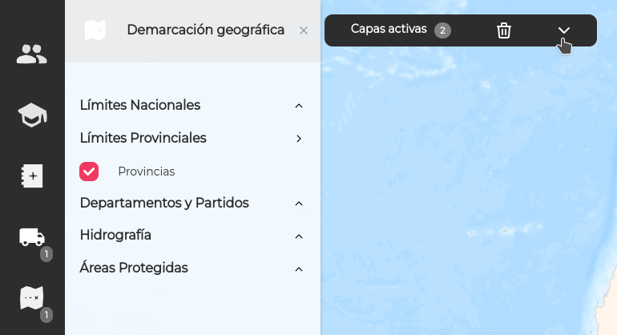

Para maximizar la superficie del mapa en la pantalla, se puede cerrar el panel de capas haciendo clic en la cruz en la esquina superior derecha. Para reabrir el panel, se hace clic en alguna categoría.

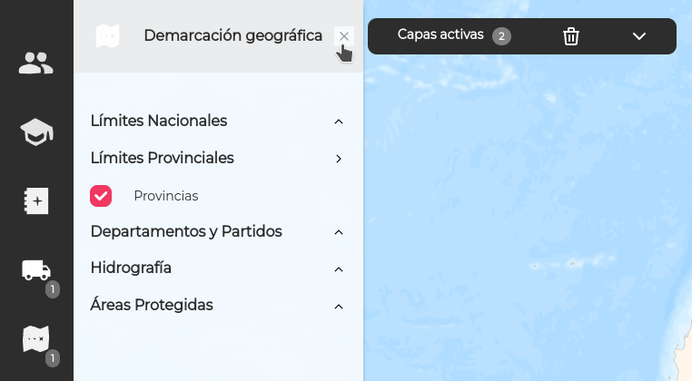

