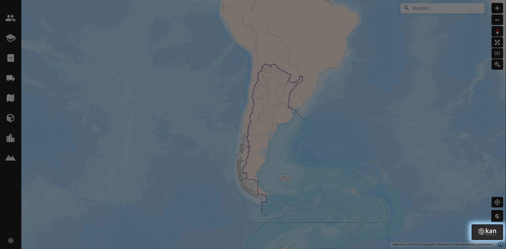

# Acceso directo a GeoNode

Este visor permite el acceso directo al [GeoNode de Geoexpress de Kan](https://geoexpress-demo.kan.com.ar) mediante el logo de Kan que se encuentra en la parte inferior izquierda del visor. Al hacer clic en el logo, se redireccionará al usuario al GeoNode.

Si contamos con los permisos suficientes podremos cargar nuevas capas, en caso contrario podremos consultarlas.

