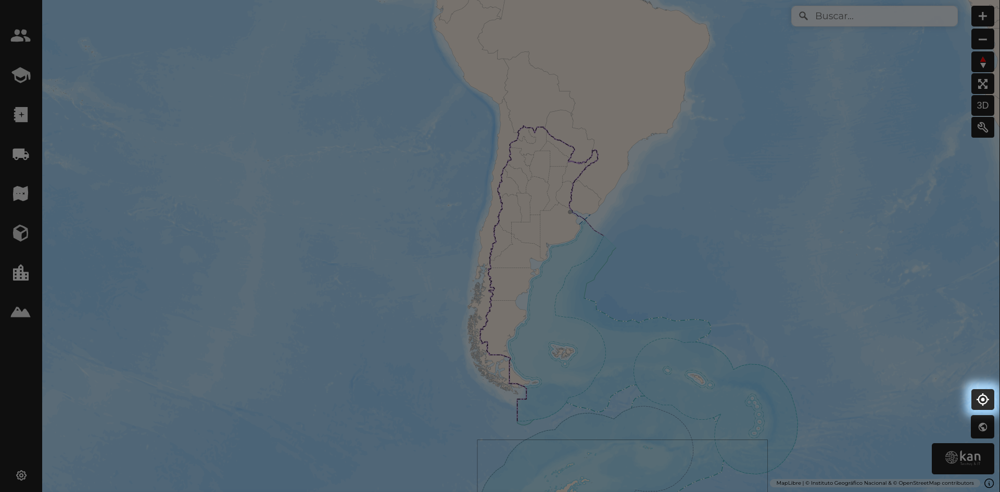
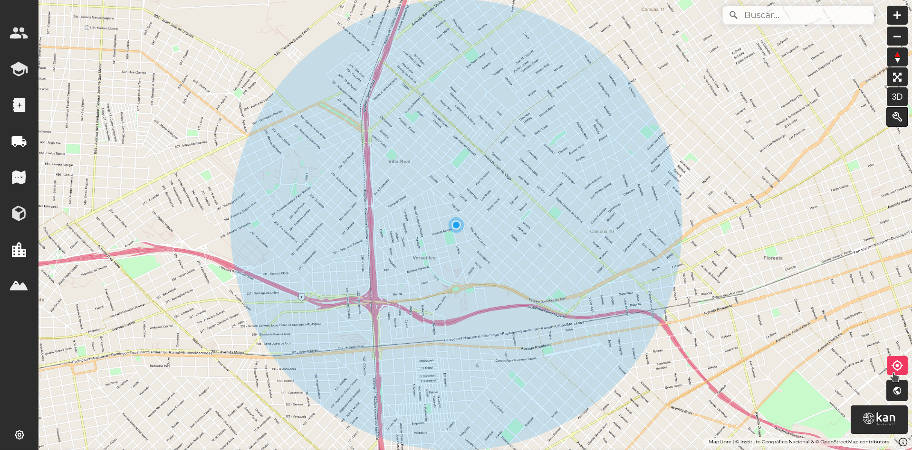

# Ubicación

Para encontrar la ubicación del dispositivo del usuario, se utiliza el botón que se encuentra en la parte inferior derecha de la pantalla, sobre el logotipo de Kan.

Al hacer clic, se hará zoom automáticamente en la ubicación del usuario, representada con un punto azul y un margen de error mostrado con un círculo azul claro.

