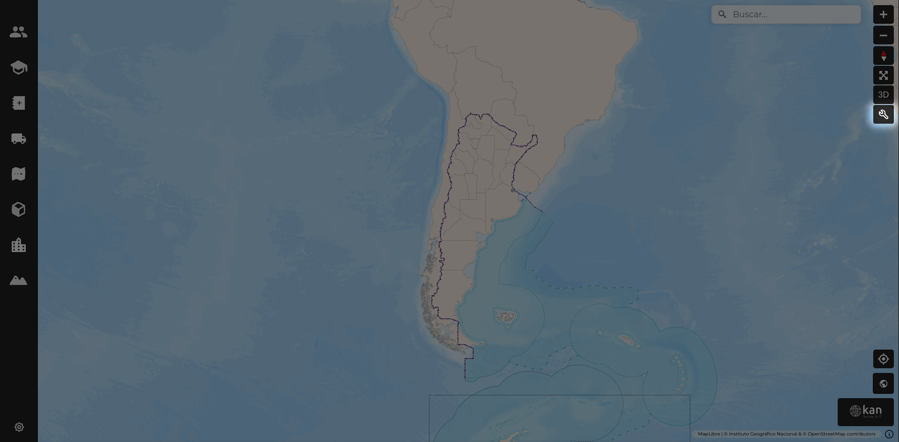
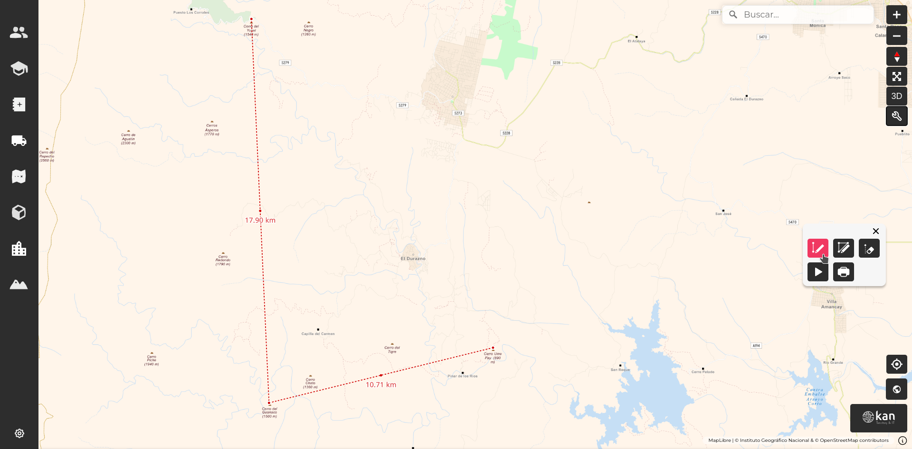
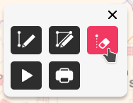
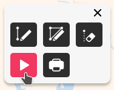

# Herramientas para el visor

El Visor Geoexpress cuenta con herramientas para medir distancias y áreas en el mapa. Hacemos clic en el ícono con forma de llave inglesa, lo que desplegará un submenú con cinco íconos.

## Medición de distancias

{ align=right }

El primer ícono sirve para medir distancias. Para iniciar una medición, haga clic en el ícono y luego en el punto del mapa desde donde comenzará a medir. Al mover el mouse desde ese punto, se trazará una línea punteada hacia el próximo punto. Una vez que el cursor llegue al punto final, haga clic nuevamente. Puede finalizar la medición haciendo doble clic, o bien trazar otra línea para continuar midiendo, aunque esta sería una nueva medición, y su longitud no se sumaría a la anterior. Si realiza varias mediciones simultáneamente, finalícelas de la misma manera, haciendo doble clic en el punto final.

Una vez finalizada la medición entre los puntos, aparecerán otros puntos intermedios. Al hacer clic en ellos, sin soltar el botón del mouse, podrá moverlos para realizar nuevas mediciones parciales. Si ajusta los puntos originales, también podrá modificar su posición con el zoom.

## Medición de areas

{ align=right }

El segundo ícono permite medir áreas. Haga clic en el ícono y luego en uno de los vértices del área. Continúe haciendo clic en cada vértice para definir el contorno del área. Al llegar al último vértice, haga doble clic para finalizar la medición, y se mostrará la superficie del área en km².

Al igual que con la medición de distancias, después de marcar el área podrá editarla moviendo los nodos que ha creado o agregando nuevos con los puntos intermedios.

Para eliminar las mediciones del mapa, haga clic en el ícono de goma de borrar.

## Modo presentación

{ align=right }

El visor tiene la opción de activar el modo presentación. El usuario debe hacer clic en el anteúltimo ícono de la barra de herramientas. Este modo permite una rotación continua de la cámara en torno al centro del mapa, ocultando todos los botones y barras del visor para mostrar solo la imagen del mapa. Para salir del modo presentación, haga clic en cualquier parte de la pantalla.

## Impresión

El último ícono permite al usuario generar un archivo imprimible a partir de la imagen del mapa. Al hacer clic en el botón, deberá configurar parámetros como tamaño de página, orientación, formato y DPI.

Podrá previsualizar el área de impresión, que aparecerá iluminada en el mapa. Las zonas más grises no se imprimirán.

Después de configurar todo, haga clic en **Generar** y el archivo se descargará. Para salir de la función de impresión, haga clic en la **x** a la derecha del encabezado del menú.

