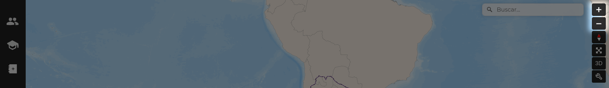
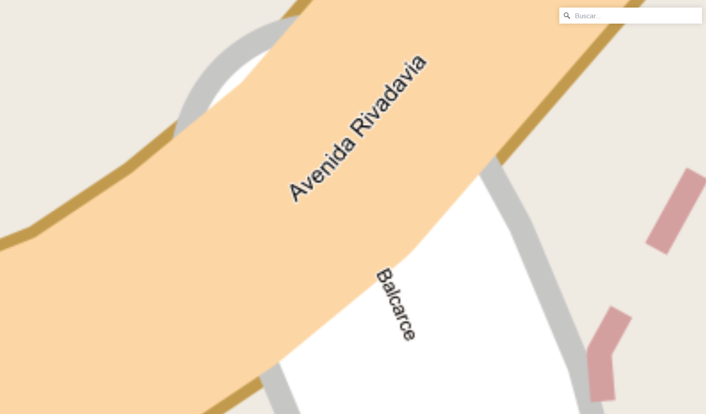
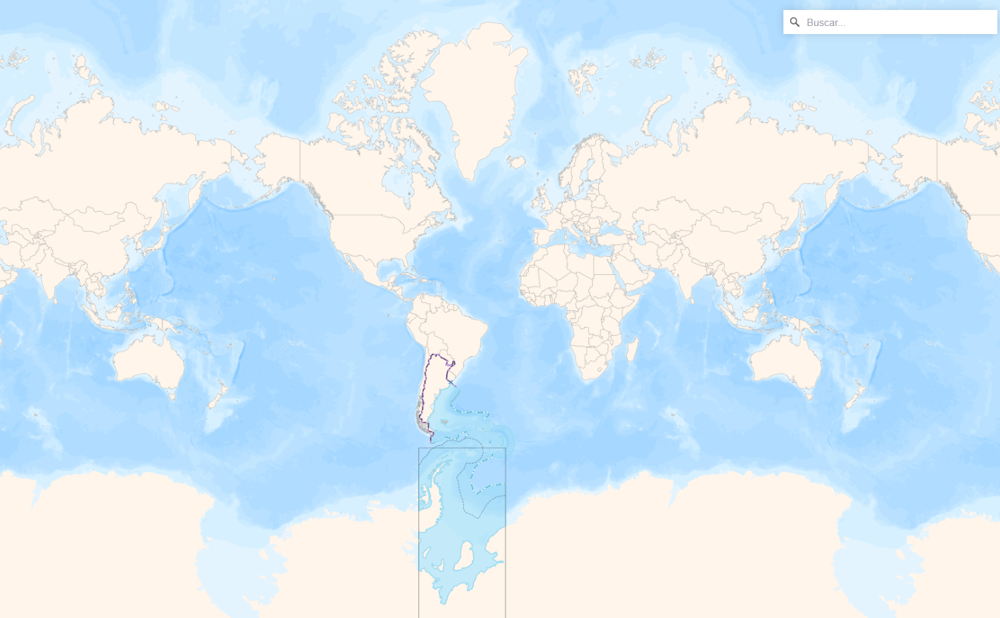

# Zoom

Para ajustar el nivel de zoom en el visor, use los botones **+** para acercar la vista del mapa y **-** para alejarla.

El nivel de zoom se muestra en la URL del visor, después del código de idioma y el **#**. Por ejemplo, en la URL [https://geoexpress.kan.com.ar/es#17.56/-34.608646/-58.372966](https://geoexpress.kan.com.ar/es#17.56/-34.608646/-58.372966), el nivel de zoom es 17.56. El zoom máximo es 22, y el mínimo es 0.9.

/// caption
Visualización a zoom 22
///

/// caption
Visualización a zoom 0.9
///

